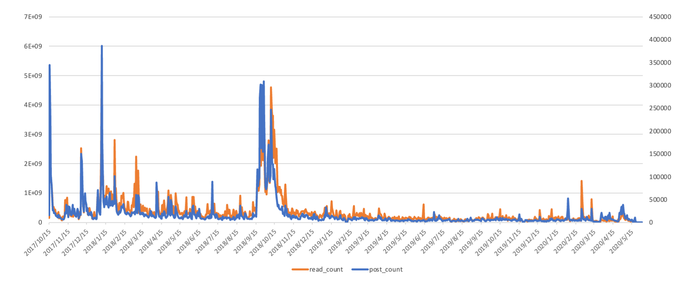
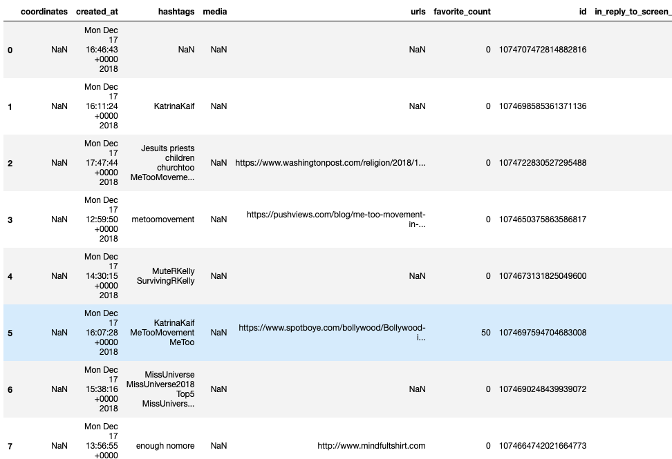
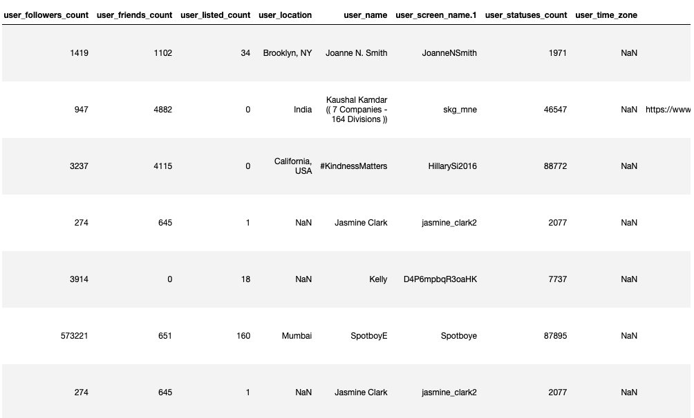
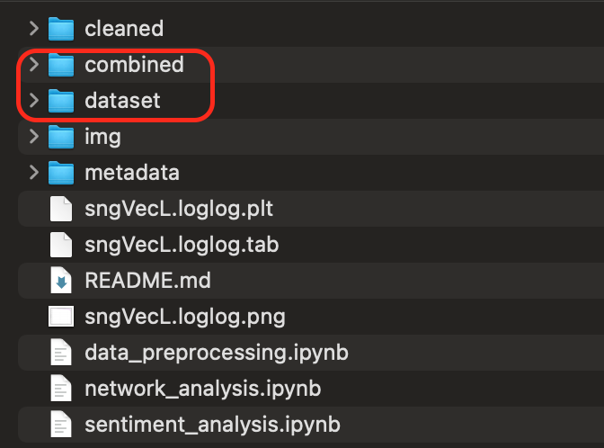

# MeToo Movement Tweet Analysis

Nowadays, social network has played a crucial role in influencing the ideology or values of a society. Our project will use Twitter data to study the time-evolving retweet network related to the MeToo movement. We hypothesize that the network structure will evolve from the star topology to the mesh topology. When users become more knowledgeable or familiar with different concepts and stories, they will be more willing to show their support, share their own stories, and respond to various online discussions. If we can use Twitter's data to create retweet network connections related to the MeToo movement, it will help people understand the thoughts of different communities more logically and rationally. Furthermore, the retweet network topology could be consumed in visualization tools to provide people with more understandable insights according to related events. 

The diagram below shows a tweets dataset relating to the MeToo movement. We're interested in seeing if each peak in the chart represents a significant occurrence.

## Summary of the Dataset
***

Data Source: #metoo Digital Media Collection - Twitter Dataset (from Harvard University)
 
Url: https://dataverse.harvard.edu/dataset.xhtml?persistentId=doi:10.7910/DVN/2SRSKJ 
 
Data Concatenation Tool: Hydrator (https://github.com/DocNow/hydrator)

Info                       | Description  |
---------------------------|:------------|
Ref    | reference from the data source https://dataverse.harvard.edu/dataset.xhtml?persistentId=doi:10.7910/DVN/2SRSKJ |
Data Description     | This dataset contains the tweet ids of 32,071,469 tweets, which are part of the Schlesinger Library #metoo Digital Media Collection |
Data Size                   | About 630 MB for raw txt files with 33 partitions (each about 20 MB) About 200 MB for transformed CSV file of one partition |
Data Collection Time Range                | October 15, 2017, to March 31, 2020. Tweets between October 15, 2017, and December 10, 2018, were licensed from Twitter's Historical PowerTrack and received through GNIP. Tweets after December 10, 2018, were collected weekly from the Twitter API through Social Feed Manager using the POST statuses/filter method of the Twitter Stream API. | 

According to the description of the dataset, this dataset contains the tweet ids of 32,071,469 tweets, which are part of the Schlesinger Library #metoo Digital Media Collection. This dataset represents the complete set of tweets collected throughout the project, ranging from October 15, 2017, to March 31, 2020. The raw dataset is a collection of text files, and each file only contains the id of MeToo related tweets. To concatenate more analytical tweet information to the dataset, we plan to use Hydrator, a powerful application for hydrating Twitter ID datasets, to combine more attributes to the data. After completing the data hydration process, the new dataset will contain 34 columns shown below

## Our Problem Definition & Goal
***

#### Problem Definition:

By analyzing the network feature of the #metoo Twitter dataset, we will discuss the following questions about public awareness through community analysis and sentiment analysis.

**_Network Analysis_**

    Network analysis will focus on the relationship between tweet id and retweet id.

    1. Whether retweet network structures are star-network or mesh-network?
    2. Have the same human rights organizations raised public awareness about different suspects?

**_Sentiment Analysis_**

    Sentiment analysis will be applied for tweet text data to gain insights into Twitter users’ feelings or attitudes toward specific MeToo posts among different communities.

    1. Are most people hatred toward suspects?
    2. Whether well-known suspects receive more positive tweets than negative tweets. 
    3. Are the top retweet text inclined to accuse the suspects?

#### End Goal:

The expected end goal will include the following milestones

    1. Split the Twitter data into multiple networks communities by filtering the suspect's related terms and finding out the retweet_id ranking through retweet_count.
    2. Plot the network connection by the retweet_id and determine whether the top retweet_id are the identical people or human rights parties in different suspect network communities.
    3. Utilize sentiment analysis to examine tweets against or support suspects and discover the user's hatred toward them.

### Prerequisites

* Download the raw data from an external google drive and put folder **dataset** and **combined** at the root path of this repo
    * [Raw Data Link](https://drive.google.com/drive/u/2/folders/1PWLUiV7-enmujxcsT3tB9GcktFIWpODP)

**Other Resources**
* [#metoo Digital Media Collection - Twitter Dataset (from Harvard University)](https://dataverse.harvard.edu/dataset.xhtml?persistentId=doi:10.7910/DVN/2SRSKJ)
* [Hydrator repo](https://github.com/DocNow/hydrator)
* [Topic modeling visualization Example](https://www.machinelearningplus.com/nlp/topic-modeling-visualization-how-to-present-results-lda-models/)

## References
* [[Bamman and Smith 2015] Bamman, D., and Smith, N. A. 2015. Contextualized sarcasm detection on twitter. In Ninth
International AAAI Conference on Web and Social Media.]()
* [Bogen, K. W., Bleiweiss, K., & Orchowski, L. M. (2018). Sexual violence is
#NotOkay: Social reactions to disclosures of sexual victimization on Twitter.
Psychology of Violence, 9, 127-137. doi:10.1037/vio0000192]()

## Team
This research is brought to you by students from VT (
[Virginia Tech CS5664 - Social Media Analytics](https://www.coursicle.com/vt/courses/CS/5664/) )
